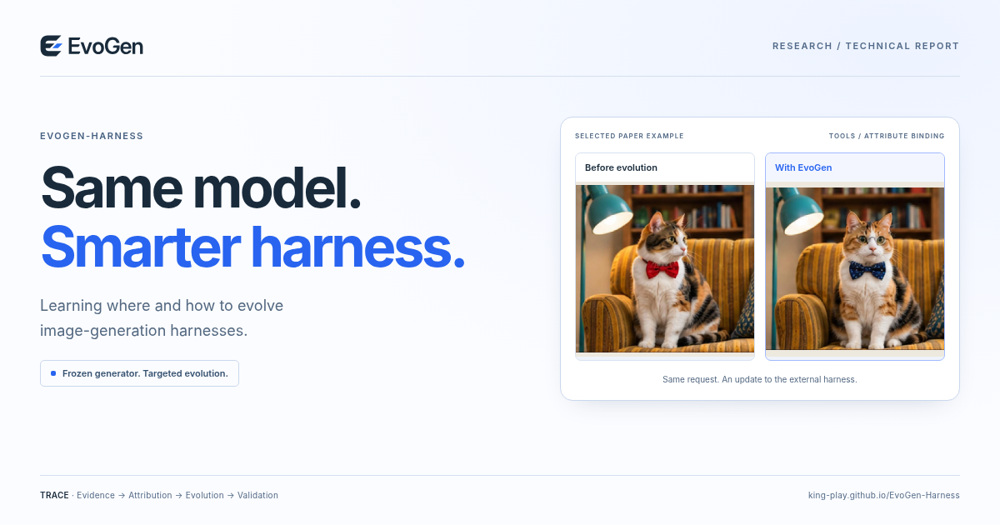

<p align="center"></p>

# EvoGen-Harness

### Same model. Smarter harness.

**Learning Where and How to Evolve Image-Generation Harnesses**

Jiabin Luo · Yinan Liu · Chunlei Meng · Yufei Guo  
Peking University · Beijing University of Posts and Telecommunications · Fudan University

[Project page](https://king-play.github.io/EvoGen-Harness/) · [Technical report](docs/assets/paper/EvoGen-Harness.pdf) · [Reported scores](docs/assets/results.csv) · [部署说明（中文）](DEPLOY_zh.md)

> The project-page address above becomes available after the repository owner enables GitHub Pages. This package does not perform remote deployment.



## Research overview

EvoGen-Harness improves the persistent external system around a **frozen image generator**. Rather than choosing a single adaptation target in advance, it opens five responsibilities to evolution: **Policy, Tools, Skills, Middleware, and Memory**.

**TRACE — Trajectory-Relative Attribution and Coordinated Evolution** — uses evidence from stochastic executions to localize candidate responsibilities, explore targeted edits, re-attribute residual failures, and retain updates that pass held-out and preservation checks. No-Patch decisions avoid unnecessary changes.

The technical report records absolute overall-score gains of **+0.2633 on GenEval2**, **+0.0720 on T2I-CompBench++**, and **+0.0752 on WISE**, relative to the strongest baseline evaluated in each corresponding table. These are **not percentage improvements**, and are author-reported results rather than an independently reproduced leaderboard. Please consult Tables 1–3 for the metrics and comparison setting, and Tables 5 and 9 for computational costs.

## What this package contains

The `docs/` directory is a complete, standalone static project website: four selectable before/after examples, three progressive-repair sequences, a five-responsibility method explorer, three benchmark views, cross-generator examples, the report PDF, and copyable citation/resources.

**The website demonstrates existing outputs from the report. It is not an online image-generation service.** This website package does not include a research implementation, trained weights, inference endpoints, API keys, or installation instructions for the model system. Implementation releases can be documented in this repository separately.

## Run locally

No Node.js, npm, framework build, external font download, or third-party JavaScript CDN is required.

```bash
python -m http.server 8000 --directory docs
```

Open `http://localhost:8000/`. Stop the server with Ctrl+C. This command only serves the static website; it does not start a model.

## Publish with GitHub Pages

Upload the **contents** of this package so the repository contains `docs/index.html`. Then choose:

```text
Settings → Pages
Source: Deploy from a branch
Branch: main
Folder: /docs
Save
```

After a successful Pages deployment, the expected address is:

```text
https://king-play.github.io/EvoGen-Harness/
```

See [DEPLOY_zh.md](DEPLOY_zh.md) for browser-upload instructions, troubleshooting, and the repository social-preview image. Existing research code should be preserved when merging these files.

## Update content

See [EDITING_zh.md](EDITING_zh.md). Examples and interaction data live in `docs/assets/js/data.js`; the initial static content, author block and metadata are in `docs/index.html`. The stylesheet is `docs/assets/css/style.css`.

Before public release, confirm the author list/affiliations, publication year, report version, and permission to publish the research. The bundled PDF was prepared from the manuscript and author information supplied during website production, and may not be your newest local draft.

## Citation

```bibtex
@misc{luo2026evogenharness,
  title  = {EvoGen-Harness: Learning Where and How to Evolve
            Image-Generation Harnesses},
  author = {Jiabin Luo and Yinan Liu and Chunlei Meng and Yufei Guo},
  year   = {2026},
  note   = {Technical report},
  url    = {https://king-play.github.io/EvoGen-Harness/}
}
```

## Source and validation notes

[ASSET_SOURCES.md](ASSET_SOURCES.md) documents the images and data. [QA_REPORT.json](QA_REPORT.json) records browser and content checks. No blanket license has been applied to the authors’ paper, figures, or branding; the authors should choose an appropriate license before granting reuse permissions.
