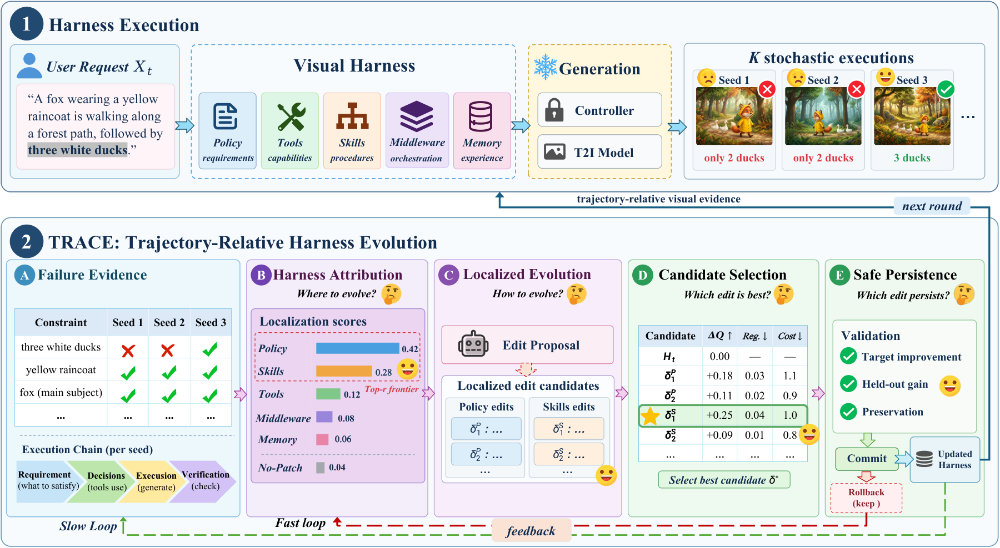
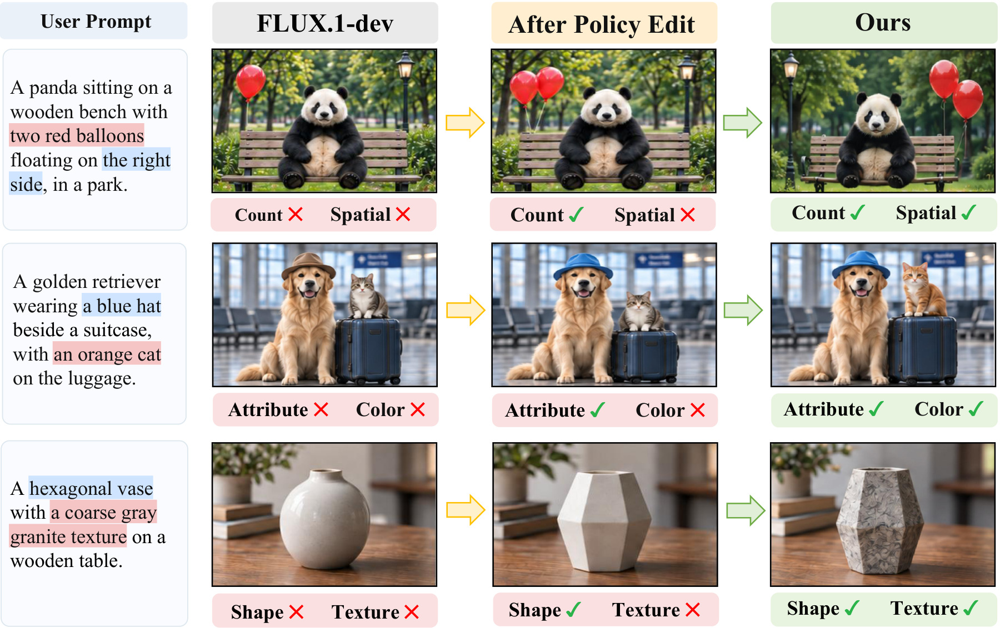
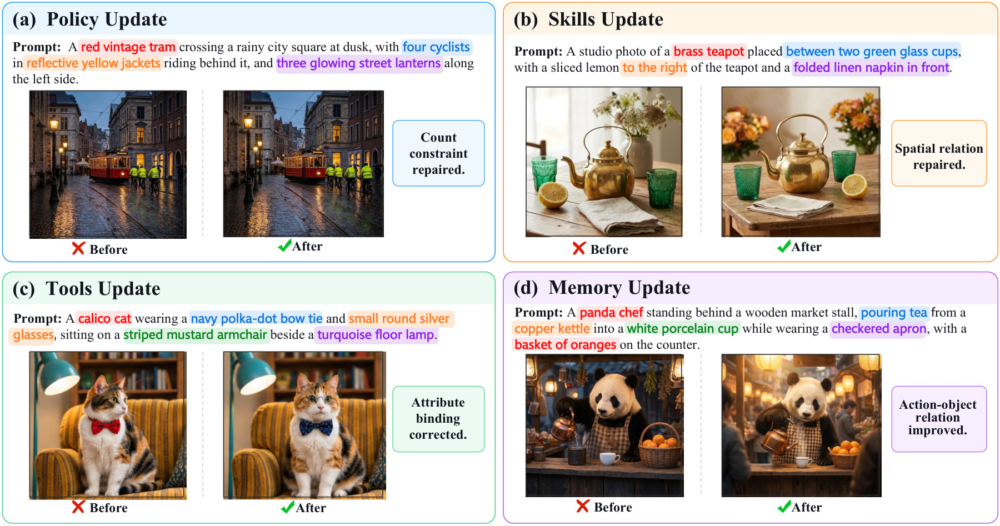
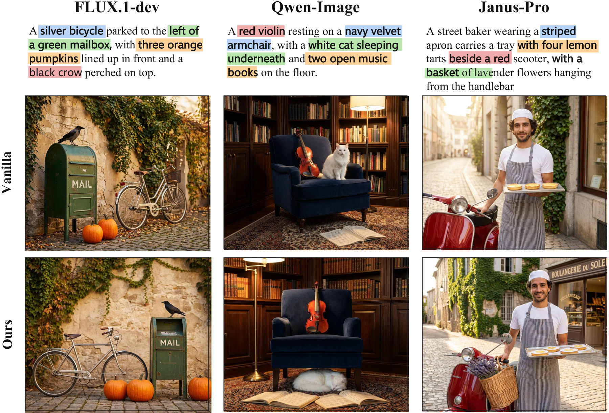

<p align="center">
  <picture>
    <source media="(prefers-color-scheme: dark)" srcset="assets/readme/logo-dark.svg">
    
  </picture>
</p>

<h1 align="center">EvoGen-Harness</h1>
<p align="center"><strong>Learning Where and How to Evolve Image-Generation Harnesses</strong></p>
<p align="center">Same model. Smarter harness.</p>

<p align="center">
  <a href="https://arxiv.org/abs/2610.00383"></a>
  <a href="documentation/INSTALL.md"></a>
  <a href="LICENSE"></a>
</p>
<p align="center">
  <a href="https://arxiv.org/abs/2610.00383"><strong>Paper</strong></a> &nbsp; · &nbsp;
  <a href="https://king-play.github.io/EvoGen-Harness/"><strong>Project &amp; Gallery</strong></a> &nbsp; · &nbsp;
  <a href="#quick-start"><strong>Quick Start</strong></a> &nbsp; · &nbsp;
  <a href="documentation/README.md"><strong>Documentation</strong></a> &nbsp; · &nbsp;
  <a href="README_zh-CN.md"><strong>中文</strong></a>
</p>
<p align="center">
  Jiabin&nbsp;Luo<sup>1</sup> &nbsp; Yinan&nbsp;Liu<sup>2</sup> &nbsp; Chunlei&nbsp;Meng<sup>3</sup> &nbsp; Yufei&nbsp;Guo<sup>1,*</sup><br>
  <sup>1</sup>&nbsp;Peking University &nbsp; <sup>2</sup>&nbsp;Beijing University of Technology &nbsp; <sup>3</sup>&nbsp;Fudan University<br>
  <sub>* Corresponding author</sub>
</p>

---

**EvoGen-Harness** is the official implementation of our generator-agnostic framework for evolving the persistent system around a **frozen image generator**. Rather than optimizing only prompts or a fixed workflow, it exposes five responsibilities—**Policy, Tools, Skills, Middleware, and Memory**—to targeted improvement.

**TRACE** (Trajectory-Relative Attribution and Coordinated Evolution) answers two questions: **where should the harness change, and how should it change?** It aggregates visual evidence across stochastic executions, uses attribution to focus edit proposals, re-localizes residual failures, and keeps only validated updates. **No-Patch** is an explicit option when persistent change is not justified.

## Overview

<p align="center"></p>

*Figure 1 from the [technical report](https://arxiv.org/abs/2610.00383). The image generator stays frozen; the external harness is what evolves.*

| Responsibility | What evolves |
| :--- | :--- |
| **Policy** | Visual requirements, constraint interpretation, and priorities |
| **Tools** | Capability and limitation records—not tool implementations or model weights |
| **Skills** | Reusable procedures, prompt templates, and decomposition strategies |
| **Middleware** | Routing, verification, retry, and termination configuration |
| **Memory** | Persistent experience, failure patterns, and validated corrective knowledge |

## See the evolution

<p align="center"></p>

*Figure 4: successive updates repair different visual constraints without changing generator weights. Explore the [interactive comparisons](https://king-play.github.io/EvoGen-Harness/) for a closer look.*

<details>
<summary><strong>More examples: responsibility-specific updates and cross-generator adaptation</strong></summary>

<p></p>

*Figure 6: different persistent failures lead to different localized edits.*

<p></p>

*Figure 7: each frozen backbone is adapted separately. This is not a claim of zero-shot transfer of one final harness across all generators.*

</details>

## Paper results

Overall scores from **Tables 1–3** of the paper. Higher is better; **Δ is an absolute score difference**, not a percentage improvement.

| Benchmark | Metric | Strongest evaluated baseline | EvoGen-Harness | Δ |
| :--- | :--- | ---: | ---: | ---: |
| GenEval2 | Overall Soft-TIFA GM | 0.4456 | **0.7089** | **+0.2633** |
| T2I-CompBench++ | Average of 8 metrics | 0.6087 | **0.6807** | **+0.0720** |
| WISE | Overall WiScore | 0.6028 | **0.6780** | **+0.0752** |

The strongest evaluated baseline in these three tables is Nano Banana. The main EvoGen-Harness configuration uses frozen **FLUX.1-dev**, **GPT-4.1**, and **OWLv2 + NVILA** internal verification. The paper also reports **87.9–91.4%** responsibility attribution recall, **94.8%** No-Patch accuracy, and **1.9%** regression.

These are **paper-reported results**, not outputs of the CPU quick start below. The comparisons are system-level, not a claim of equal generator backbones or zero additional compute. See Tables 4–5 and 9 for same-backbone comparisons, inference cost, and evolution cost.

## Quick start

### 1. Install the lightweight development environment

Run commands from the repository root. **Python 3.11** is the reference version for the supplied GPU environment; the lightweight tools also run on newer Python versions.

```bash
git clone https://github.com/King-play/EvoGen-Harness.git
cd EvoGen-Harness
conda create -n genharness python=3.11 -y
conda activate genharness
pip install --upgrade pip
pip install -r requirements.txt
```


### 2. Check the code and the supplied data—no GPU or API key

```bash
python -m gen_harness.cli --help
python -m pytest -q -rs
python scripts/check_release.py
python scripts/prepare_evolution.py --output runs/quickstart/evolution_tasks.jsonl
```

The last command validates and combines the **included 500 target / 100 held-out / 100 preservation prompts**. It does not download or re-sample data. Counts, checksums, disjointness, and the exact-match overlap scope in the supplied manifest are checked before writing a working copy. Details: [evolution data](data/evolution/README.md).

### 3. Estimate an evolution run before spending compute

```bash
python -m gen_harness.cli self-evolve-run \
  --harness examples/visual_harness \
  --tasks runs/quickstart/evolution_tasks.jsonl \
  --output-dir runs/quickstart/evolution \
  --backend-config configs/backends/flux1_dev_diffusers.json \
  --inspection-config configs/inspection/composite_owlv2_nvila_strong.json \
  --policy-extractor-config configs/policy_extractors/openai_chat_policy_extractor.json \
  --harness-localizer-config configs/patch_proposers/openai_chat_harness_localizer.json \
  --patch-proposer-config configs/patch_proposers/openai_chat_patch_proposer.json \
  --trace-dataset-protocol paper_p2 \
  --seeds 0,1,2,3 --max-rounds 3 --dry-run-budget
```

This is a **budget-only check**: no image generation, no paid API calls, and no harness updates. It checks the 500/100/100 split contract, not the full model environment. Do not simply remove `--dry-run-budget` before completing [runtime setup](documentation/INSTALL.md) and the [evolution workflow](documentation/EVOLUTION.md).

## Run with real models

Use [the GPU installation and environment guide](documentation/INSTALL.md) to install the supplied inference dependencies, set model paths, and configure the LLM endpoint. Then start with a small real generation run:

```bash
python -m gen_harness.cli generate \
  --dataset geneval2 \
  --harness examples/visual_harness \
  --tasks data/geneval2/geneval2_tasks_prompt_only_smoke32_2026_09_04.jsonl \
  --output-dir runs/geneval2_smoke \
  --backend-config configs/backends/flux1_dev_diffusers.json \
  --inspection-config configs/inspection/composite_owlv2_nvila_strong.json \
  --policy-extractor-config configs/policy_extractors/openai_chat_policy_extractor.json \
  --harness-localizer-config configs/patch_proposers/openai_chat_harness_localizer_fastloop.json \
  --patch-proposer-config configs/patch_proposers/openai_chat_patch_proposer_fastloop.json \
  --seeds 0 --limit 1
```

**This command calls real models and may incur API costs.** `--limit 1` is a functional smoke test, not a benchmark result. `examples/visual_harness` is the supplied harness configuration; this release does not identify it as the historical final paper checkpoint.

The two LLM configuration pairs are intentionally distinct: the unsuffixed files are used for **persistent TRACE evolution**, and the `*_fastloop.json` files for **transient per-request repair**. All generation uses internal verification; official benchmark scores are computed separately after generation.

## Benchmark evaluation

Persistent evolution, generation-time verification, and official scoring are separate stages. The complete three-benchmark workflows are collected below and in [the evaluation guide](documentation/EVALUATION.md).

<details>
<summary><strong>Expand: prepare prompts → generate images → export for official scoring</strong></summary>

After completing runtime setup, select your real archived harness and the official benchmark input locations. The path below is produced by the [evolution workflow](documentation/EVOLUTION.md), not a bundled historical checkpoint:

```bash
export EVOGEN_EVAL_HARNESS="artifacts/my_run/final_harness"
```

Official benchmark labels and scores are never used during generation, localization, proposal, or fast-loop repair. The workflow is always:

1. convert benchmark prompts to prompt-only Gen-Harness tasks;
2. generate the full image set with EVOGEN-HARNESS;
3. freeze the generated images and export the official evaluator input;
4. run the official evaluator separately.

Do not use `--limit` for a full benchmark run. Use it only for smoke tests.

### GenEval2

```bash
python -m gen_harness.cli build-tasks \
  --dataset geneval2 \
  --benchmark-data /path/to/geneval2_data.jsonl \
  --output data/geneval2/tasks.jsonl

python -m gen_harness.cli generate \
  --dataset geneval2 \
  --harness "$EVOGEN_EVAL_HARNESS" \
  --tasks data/geneval2/tasks.jsonl \
  --output-dir runs/geneval2 \
  --backend-config configs/backends/flux1_dev_diffusers.json \
  --inspection-config configs/inspection/composite_owlv2_nvila_strong.json \
  --policy-extractor-config configs/policy_extractors/openai_chat_policy_extractor.json \
  --harness-localizer-config configs/patch_proposers/openai_chat_harness_localizer_fastloop.json \
  --patch-proposer-config configs/patch_proposers/openai_chat_patch_proposer_fastloop.json

python -m gen_harness.cli export-eval \
  --dataset geneval2 \
  --experiences runs/geneval2/gen_harness_generations.jsonl \
  --benchmark-data /path/to/geneval2_data.jsonl \
  --output runs/geneval2/image_map.json
```

Then run the official GenEval2 evaluator from `$GENHARNESS_GENEVAL2_OFFICIAL_REPO` with model weights from `$GENHARNESS_GENEVAL2_EVAL_MODEL` on `runs/geneval2/image_map.json`.

### T2I-CompBench++

```bash
python -m gen_harness.cli build-tasks \
  --dataset t2icompbenchpp \
  --dataset-dir /path/to/T2I-CompBench++ \
  --output data/t2icompbenchpp/tasks.jsonl

python -m gen_harness.cli generate \
  --dataset t2icompbenchpp \
  --harness "$EVOGEN_EVAL_HARNESS" \
  --tasks data/t2icompbenchpp/tasks.jsonl \
  --output-dir runs/t2icompbenchpp \
  --backend-config configs/backends/flux1_dev_diffusers.json \
  --inspection-config configs/inspection/composite_owlv2_nvila_t2icompbenchpp.json \
  --policy-extractor-config configs/policy_extractors/openai_chat_policy_extractor.json \
  --harness-localizer-config configs/patch_proposers/openai_chat_harness_localizer_fastloop.json \
  --patch-proposer-config configs/patch_proposers/openai_chat_patch_proposer_fastloop.json

python -m gen_harness.cli export-eval \
  --dataset t2icompbenchpp \
  --tasks data/t2icompbenchpp/tasks.jsonl \
  --experiences runs/t2icompbenchpp/gen_harness_generations.jsonl \
  --manifest-dir runs/t2icompbenchpp/eval_manifests \
  --sample-root runs/t2icompbenchpp/eval_samples \
  --copy
```

Then run the official T2I-CompBench++ metrics from `$GENHARNESS_T2ICOMPBENCHPP_OFFICIAL_REPO` with assets from `$GENHARNESS_T2ICOMPBENCHPP_ASSET_DIR` on `runs/t2icompbenchpp/eval_manifests` and `runs/t2icompbenchpp/eval_samples`.

### WISE

```bash
python -m gen_harness.cli build-tasks \
  --dataset wise \
  --benchmark-data /path/to/wise.jsonl \
  --output data/wise/tasks.jsonl

python -m gen_harness.cli generate \
  --dataset wise \
  --harness "$EVOGEN_EVAL_HARNESS" \
  --tasks data/wise/tasks.jsonl \
  --output-dir runs/wise \
  --backend-config configs/backends/flux1_dev_diffusers.json \
  --inspection-config configs/inspection/composite_owlv2_nvila_strong.json \
  --policy-extractor-config configs/policy_extractors/openai_chat_policy_extractor.json \
  --harness-localizer-config configs/patch_proposers/openai_chat_harness_localizer_fastloop.json \
  --patch-proposer-config configs/patch_proposers/openai_chat_patch_proposer_fastloop.json

python -m gen_harness.cli export-eval \
  --dataset wise \
  --tasks data/wise/tasks.jsonl \
  --experiences runs/wise/gen_harness_generations.jsonl \
  --output runs/wise/official_input.jsonl
```

Then run the official WISE/WiScore evaluator from `$GENHARNESS_WISE_OFFICIAL_REPO` with model weights from `$GENHARNESS_WISE_EVAL_MODEL` on `runs/wise/official_input.jsonl`.

`/path/to/...` denotes an external benchmark checkout/input that you must supply. The official evaluator variables describe separately installed tools, not automatic scoring triggered by this CLI. Keep the raw output mappings and score files; verify the harness snapshot after generation.

</details>

## Workflows and documentation

| Goal | Guide |
| :--- | :--- |
| Configure GPU, models, endpoint, and credentials | [Installation](documentation/INSTALL.md) |
| Evolve, snapshot, and freeze a persistent harness | [TRACE workflow](documentation/EVOLUTION.md) |
| Prepare and evaluate GenEval2, T2I-CompBench++, and WISE | [Evaluation](documentation/EVALUATION.md) |
| Understand the module boundaries | [Architecture](documentation/ARCHITECTURE.md) |
| Inspect the supplied data and artifact provenance | [Release scope](documentation/REPRODUCIBILITY.md) |
| Merge this release without replacing the website | [中文上传说明](UPLOAD_GITHUB_zh.md) |

## Repository layout

```text
gen_harness/             Core implementation and CLI
configs/                 Generator, verifier, policy, localizer, and proposer configs
examples/visual_harness/ Supplied five-responsibility harness
examples/tasks/          Small task-schema and usage examples
data/evolution/          P2 500/100/100 files, provenance, and checksums
data/geneval2/           Prompt-only benchmark inputs and smoke subsets
scripts/                 Verifier adapters and release helpers
tests/                   Unit and optional integration tests
assets/readme/           Locally bundled figures, badges, and light/dark logos
documentation/           Setup, evolution, evaluation, and release notes
artifacts/               Documented interface for separately archived real runs
```

The existing GitHub Pages site remains in `docs/` when this code is merged into the live repository. This code archive deliberately does not replace that directory.

## Citation

```bibtex
@misc{luo2026evogenharness,
  title         = {{EvoGen-Harness}: Learning Where and How to Evolve Image-Generation Harnesses},
  author        = {Jiabin Luo and Yinan Liu and Chunlei Meng and Yufei Guo},
  year          = {2026},
  eprint        = {2610.00383},
  archivePrefix = {arXiv},
  primaryClass  = {cs.LG},
  url           = {https://arxiv.org/abs/2610.00383}
}
```

Also available as [BibTeX](CITATION.bib) and [CITATION.cff](CITATION.cff).

## Contributing and license

Bug reports and focused pull requests are welcome. Please read [CONTRIBUTING.md](CONTRIBUTING.md); avoid posting credentials or private prompts in issues. See [SECURITY.md](SECURITY.md) for security reporting.

The project code retains the **[MIT License](LICENSE)** supplied by the authors. Third-party datasets and model weights retain their own terms: see [THIRD_PARTY_NOTICES.md](THIRD_PARTY_NOTICES.md). In particular, the code license does not relicense FLUX.1-dev weights or GenEval2 data. Models, private credentials, and historical experiment logs are not bundled.
